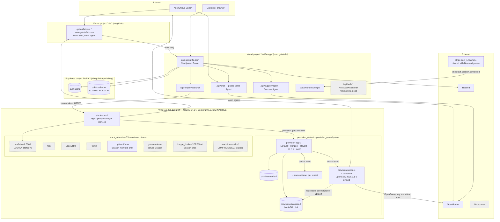
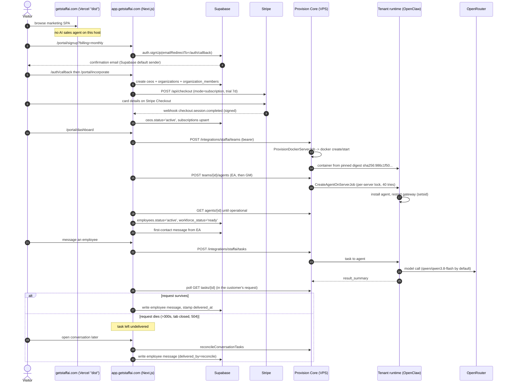
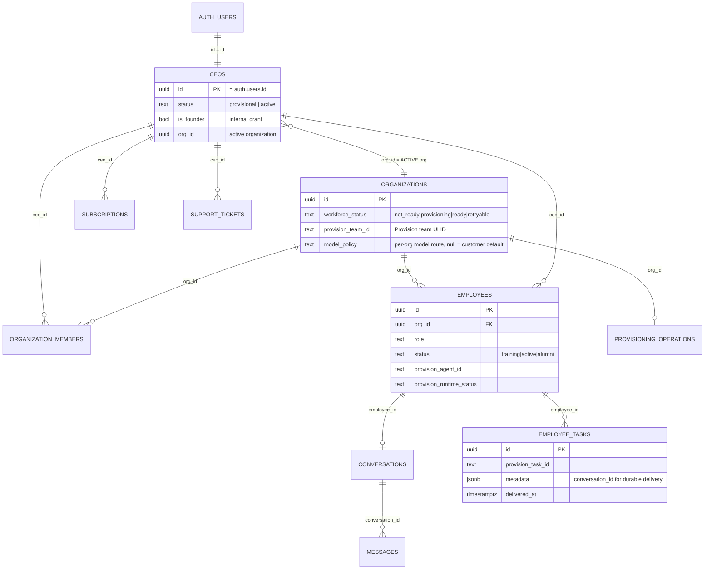

# Staff AI — As-Built Diagrams, 2026-09-05

Companion to `STAFFAI-AS-BUILT-2026-09-05.md`. Every diagram here describes what
is deployed and observed, not intended architecture. Dashed lines mark paths
that exist in code but are not reachable in production.

---

## 1. System topology as built



Legend: grey/dashed nodes are present on the host but not part of the live
Staff AI production path.

---

## 2. Customer journey as built



---

## 3. Control-plane data model (architecture-critical only)



Tenant boundary: `organization_members` decides which organizations a CEO may
act as; `ceos.org_id` is the one currently active. Every org-scoped query filters
on `ceo.org_id`. RLS additionally restricts direct client reads to
`auth.uid() = ceo_id`, and `organizations` to rows the caller is a member of.

---

## 4. Runtime ownership and the OpenClaw pin

```mermaid
flowchart LR
  A[Staff AI: provisionAgentRuntime] -->|POST teams/{team}/agents| B[StaffAiIntegrationController]
  B --> C[CreateAgentOnServerJob<br/>tries=40, backoff 10/15/20/30]
  C --> D{Cache::lock<br/>docker-runtime:serverId<br/>lease 360s}
  D -->|acquired| E[AgentUpdateScriptService<br/>generateOpenClawScript]
  E --> F["flock /var/lock/openclaw-install.lock -c<br/>'if ! &lt;dist check literal&gt;; then rm -rf ...; fi;<br/>openclaw update --tag <b>2026.7.1-2</b> --yes --json<br/>|| npm install -g <b>openclaw@2026.7.1-2</b>'"]
  F --> G[verify version + dist integrity<br/>fail closed]
  G --> H[pkill -f 'openclaw[- ][g]ateway'<br/>setsid nohup openclaw gateway ... disown]
  H --> I[WorkforceReadiness.inspect<br/>accepts agents.list and agents.entries]
  I --> J[Staff AI polls GET agents/{id}<br/>until operational]

  style F fill:#dfd,stroke:#2a2
  style H fill:#ffd,stroke:#aa2
```

The green box is the corrected defect. It previously read
`"openclaw@$PINNED_OPENCLAW_VERSION"` inside a single-quoted `flock -c` payload.
`flock -c` runs a new shell; the variable was never exported, so the payload
expanded to `npm install -g "openclaw@"` (newest release) and the integrity test
degraded to `sh -c ""` (always true, so a corrupt tree was never cleared).

The yellow box is the known interruption: installing or dismissing an employee
restarts the tenant's single shared gateway, so the whole workforce is briefly
offline and in-flight work on that runtime can be lost.
